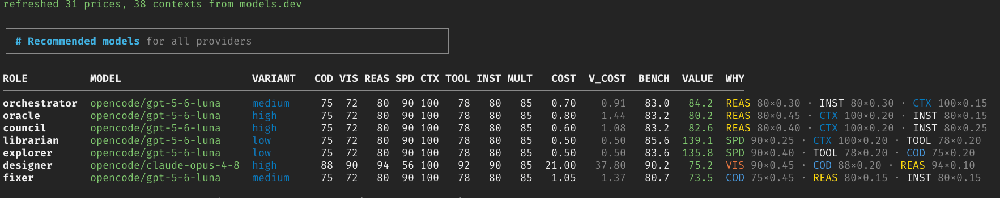
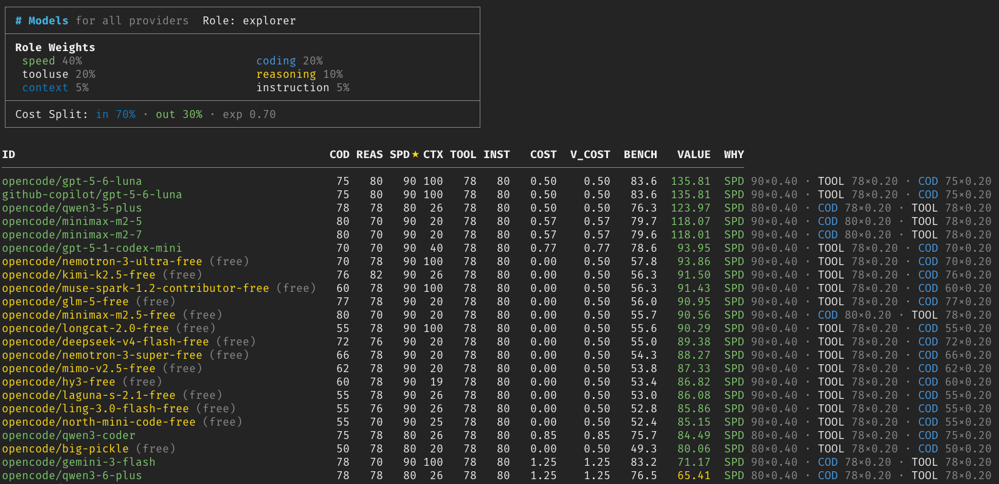
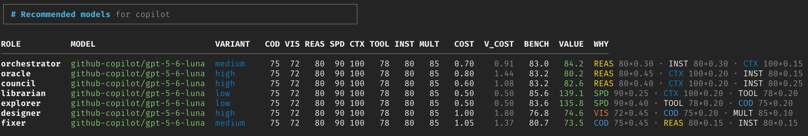
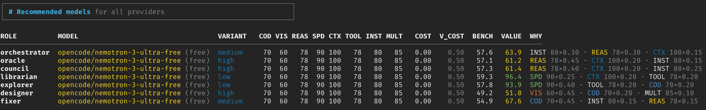
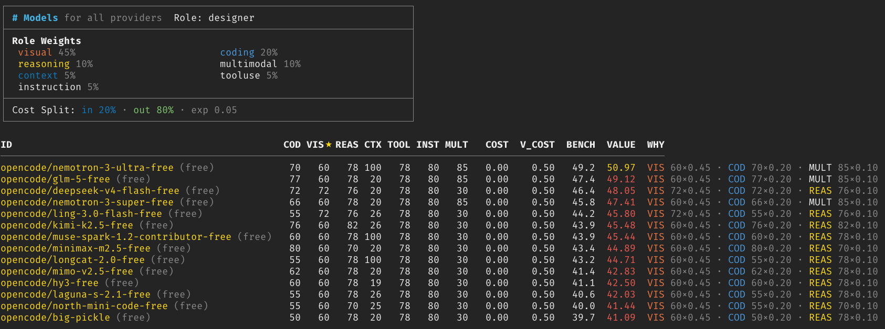
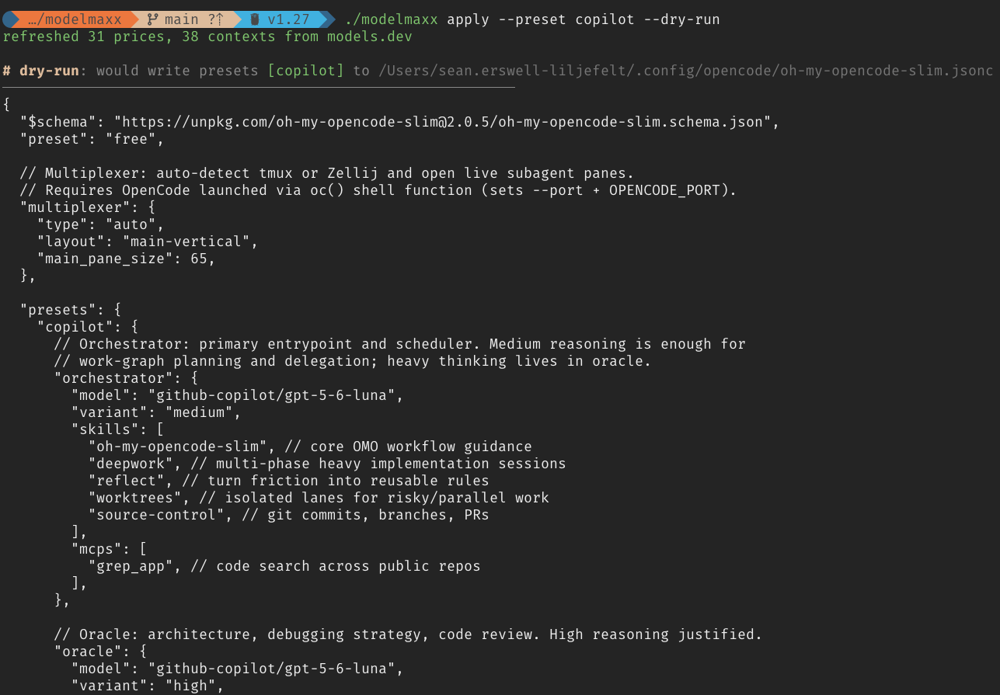
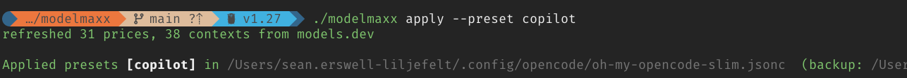

# modelmaxx

Its a new week! So there are new models, new pricing, new tweaks, new benchmarks, new research...

It's an endless task to continuously optimise your harness, agents and model selections to **keep
the quality up whilst keeping the price down**.

Is the latest and greatest good? Does it excel at the things you need it to? Does a model that works
well for one usecase suffice for others? Or am I throwing money after the marketing hype? Perhaps a
free model performs just as well or good enough for my research agent but it's worth paying a
premium for a special case?

modelmaxx pulls the latest pricing data and benchmarks from major providers (opencode and github
copilot currently), weights their performance according to specific roles and recommends the best
bang for buck for each type of agent in your harness!

If you are using [oh-my-opencode-slim](https://github.com/alvinunreal/oh-my-opencode-slim) like me,
it can even update your configuration too! Even if you are using something else, you can map the
OMO-Slim roles to those of your own harness to get those recommendations.

# Install

```bash
# From source (requires Go 1.27+)
go install github.com/erzz/modelmaxx@latest

# Or build locally
go build -o modelmaxx .      # IMPORTANT: not `go build ./...` (discards the binary)
```

# Run

```bash
modelmaxx recommend         # ranks all roles, auto-fetches prices from models.dev
modelmaxx list              # shows all models + metrics
modelmaxx apply --preset free --dry-run   # preview preset edits
modelmaxx config --overwrite # generate default config at ~/.config/modelmaxx/config.yaml
```

See [Custom Configuration](docs/custom-config.md) for defining your own agent roles (e.g.,
`builder`, `reviewer`).

# Visual walkthrough

## 1. Default recommendation (all providers, all roles)

```bash
modelmaxx recommend
```



Shows the best value model for each of the 7 roles across all providers. 6/7 roles pick GPT-5.6
Luna; Designer diverges to Claude Opus 4.8 for visual capability.

## 2. Why was a model recommended for a role?

```bash
modelmaxx list --role explorer
```



Shows all models ranked for the Explorer role with metrics, costs, and the weighted scoring
breakdown. Explorer weights speed (40%) and cost (exponent 0.70) heavily.

## 3. Filter to a specific provider (Copilot)

```bash
modelmaxx recommend --provider copilot
```



Same roles, but only models available via GitHub Copilot. Note: Copilot often reduces context
windows, affecting scores.

## 4. Free-only recommendations

```bash
modelmaxx recommend --free
```



Filters to only free models across all providers. Useful for zero-cost workflows.

## 5. Free + specific role (Designer)

```bash
modelmaxx recommend --free --role designer
```



Shows the best free model for the Designer role. Visual capability is weighted 45%, so even among
free models, the one with highest visual score wins.

## 6. Preview applying to OMO-Slim config (dry-run)

```bash
modelmaxx apply --preset copilot --dry-run
```



Shows exactly what would be written to your oh-my-opencode-slim config without making changes.

## 7. Apply for real

```bash
modelmaxx apply --preset copilot
```



Writes the recommended models into your OMO-Slim config (creates backup at `.bak`).

## 8. Just explore all models with no role

```bash
modelmaxx list
```

# Roles

modelmaxx is designed with oh-my-opencode-slim in mind. But the roles are usually easily
translatable to your own set-up too.

OMO-slim has multiple pre-configured agents:

| Role         | What it does                                                                        | What we weight                                         |
| ------------ | ----------------------------------------------------------------------------------- | ------------------------------------------------------ |
| orchestrator | Plans, dispatches and judges across agents — needs sound judgment and obedience     | reasoning + instruction lead; context; light coding    |
| oracle       | Deep-thinking reviewer of code, architecture & approach — highest reasoning demands | reasoning dominant; context, instruction, coding       |
| council      | Synthesises perspectives for high-stakes decisions                                  | reasoning + instruction for synthesis; context, coding |
| librarian    | Fast, cheap research / lookup                                                       | speed + cheapness; context, tooluse, coding            |
| explorer     | Fast, cheap codebase recon                                                          | speed dominant; coding, tooluse; cheap                 |
| designer     | UI/UX design & visual polish                                                        | visual dominant; coding, reasoning , multimodal        |
| fixer        | Reliable, efficient coding execution                                                | coding dominant; instruction, reasoning, context       |

# How modelmaxx chooses models per role

**Role specific capability benchmarks -> cost (including variant recommendations) -> value**

Take the following benchmarks for the "Oracle" agent. The role is a deep thinking reviewer and
architect that requires lots of reasoning, a large context plus decent coding, understanding of
instructions and a little tool use.

Picking a model from your head, you might say GPT Sol right? That's what the marketing says at
least!

```
ID                           COD  REAS★  CTX TOOL INST COST  V_COST  BENCH  VALUE
──────────────────────────────────────────────────────────────────────────────────
github-copilot/gpt-5-6-luna   75   80   100   78   80    0.80    1.44   83.2  80.17
opencode/gpt-5-6-luna         75   80   100   78   80    0.80    1.44   83.2  80.17
opencode/claude-opus-4-8      88   94   100   92   90   17.00   30.60   93.7  66.55
github-copilot/gpt-5-6-sol    82   82   100   78   80    6.80   12.24   85.1  66.27
```

Our benchmarks and value calculations actually put luna in the lead! Why?

According to this output, opus 4-8 wins right? It has a better score on almost every metric and our
weighting system (BENCH) gives it the highest score for the attributes it needs. It even beats GPT
Sol on the metrics that matter.

But once you account for price? You actually get the best value by using luna! Even though its about
10% lower on our benchmark, when you consider bang-for-buck, an 9x markup for sol or a ~18x markup
for opus just doesnt make sense. Luna gives an excellent performance for a fraction of the price.

And given a choice between luna and sol? There just 2 points difference in the benchmark yet a 900%
price premium for sol.

THAT's what this tool does! Eliminate the guesswork and maxx's your model selection instead of your
tokens!

# The cost factor

After calculating weighting of capabilties, we also consider how pricing will work for that agent.

- what level of effort should it use?
- will it consume more input tokens or output tokens?
- how important will the "lag" and reliability of typically over-loaded free offerings be?

So for each role we figure out an estimation of the ratio of input/output tokens based on its role.

| Role         | Input / Output token split | Cost exponent | Why                                                      |
| ------------ | -------------------------- | ------------- | -------------------------------------------------------- |
| orchestrator | 50% / 50%                  | 0.15          | balanced planning and responses                          |
| oracle       | 40% / 60%                  | 0.10          | long reasoning outputs dominate the cost                 |
| council      | 60% / 40%                  | 0.10          | reads many perspectives (input-heavy), shorter synthesis |
| librarian    | 70% / 30%                  | 0.70          | ingests docs/queries, returns short answers              |
| explorer     | 70% / 30%                  | 0.70          | ingests codebases, returns short findings                |
| designer     | 20% / 80%                  | 0.05          | small prompts, large generated UI/code                   |
| fixer        | 15% / 85%                  | 0.30          | small task briefs, large code output                     |

Of course - if the tool was really dumb, free models would always win. However they tend to be
"inconsistent" in availability/performance. So we additionally balance this with some exponents that
try to balance when its worth paying for a premium model because of it's excellence versus lifting
out cheaper options where the real world experience is likely to perform extremely similarly.

Higher exponent → cost weighs more in the value score, so free/cheap models win. Some people will
want to apply more weight to quality than price or vice-versa. So you can tune your own preferences
with the `--costbias` (default 1.0) flag: >1 leans free, <1 leans paid, 0 = pure capability.

A great example of this is the designer role where we really value the quality of the multimodal and
visual capabilities of some models. If we run the tool to recommend a model for this agent we get:

```
────────────────────────────────────────────────────────────

ID                                     COD VIS★ REAS CTX TOOL INST MULT   COST  V_COST  BENCH  VALUE
─────────────────────────────────────────────────────────────────────────────────────────────────────────
github-copilot/gpt-5-6-luna             75   72   80 100   78   80   85   1.00    1.80   76.8  74.58
github-copilot/gpt-5-6-terra            81   85   88 100   92   90   85  10.00   18.00   85.8  74.30
github-copilot/gemini-3.1-pro-preview   80   82   88 100   92   90   85  10.00   18.00   84.4  73.06
github-copilot/claude-opus-4-8          88   90   94  20   92   90   85  21.00   37.80   86.2  71.90
github-copilot/claude-opus-4-7          87   90   94  20   92   90   85  21.00   37.80   86.0  71.73
```

So luna comes out on top even though its 10+ points lower on numerous metrics. **However it IS
providing 90% of the capability for 5% of the cost!**

But if you really value that last 10% so much you want to pay so much more for the anthropic models
to come out on top, you can add `--costbias 0.5` which significantly reduces the importance of cost.
But seriously, you likely won't see much difference unless you have some VERY demanding needs!

## How models are ranked & rated per role

### Metrics

Every model is rated on 8 capability metrics (0–100): `coding`, `visual`, `reasoning`, `speed`,
`context`, `tooluse`, `instruction`, `multimodal`.

### Role weights

Each role has a weight vector over the 8 metrics (summing to 1.0), derived from the OMO-Slim "Model
Guidance" for that agent. Example: `oracle` is reasoning-dominant (0.45), `explorer` is
speed-dominant (0.40), `designer` is visual-dominant (0.45).

### Merit (`bench`)

```
bench(role, m) = Σ(roleWeight · metric) × freePenalty
freePenalty = 0.7 if model is free else 1.0
```

Free models are penalized depending on the role (reliability/quality/privacy risk).

### Cost

```
cost(role, m)   = priceIn · wIn + priceOut · wOut        # roleCostSplit per role
effCost(V_COST) = cost × variantMult        (paid)
                = max(cost, 0.5)            (free, floored)
```

`variantMult` reflects the role's recommended reasoning effort: low/none = 1.0, medium = 1.3, high =
1.8. Free models are floored at `freeCostFloor = 0.5` (regardless of variant — they cost $0; the
floor captures reliability risk).

### Value (the ranking score)

```
value(role, m) = bench(role, m) / cost(role, m) ^ roleCostWeight
```

The exponent is multiplied by `--costbias` (default 1.0), applied per role.

`roleCostWeight` is a per-role exponent. High exponent (0.70 for librarian/explorer) → cost matters
a lot, cheap/free models win. Low exponent (0.05–0.15 for thinking/design roles) → capability
dominates, paid models win.

### Ranking

Models are ranked by `value` descending per role. There is no hard merit gate — ranking is pure
value (a previous `minBench` floor was removed as a crude crutch that contradicted the weights).

### Design principle

The goal is **not** to pick paid models for their own sake. When two models are within ~1–2 bench
points (negligible quality difference), the cheaper/free model should win.

### Commands

- `list` — list models and metrics
- `recommend` — recommend a model per role
- `apply` — write recommendations into an opencode config
- `fetch` — refresh prices/contexts from models.dev

### Flags

- `--provider` (opencode|copilot|all)
- `--costbias <float>` — scales the cost exponent (default 1.0; >1 leans free/cheap, <1 leans
  paid/capable, 0 = pure capability). Replaces --free.
- `--preset` — target preset name
- `--no-fetch` — skip the models.dev price refresh
- `--config` — path to opencode config
- `--dry-run` — preview only
- `--role` — limit to one role
- `--free` — show only free (cost) models
- `--paid` — show only paid models

## Data

`models.json` holds the candidate models and their metrics (46 entries). Prices and contexts are
refreshed from [models.dev](https://models.dev) on each run unless `--no-fetch`.

# FAQ

## Why does copilot rank lower than others?

You may notice that sometimes the same model (e.g. GPT Terra) has different scores for different
providers. Often a model from copilot is ranking significantly lower than the same model from
another provider such as opencode-zen.

This is because copilot often reduces context size (presumably for cost saving). Other providers do
not do this! So if the context window size is an important metric for a specific role, then those
with the original, larger context window will of course win!

## When will you support other providers

Working on the principle of YAGNI - when someone asks for it

## When will you support config writing for other tools

Working on the principle of YAGNI - when someone asks for it

## I don't like your weightings

No problem, you can edit anything you want in the config at `~/.config/modelmaxx/config.yaml`

## How can I add/remove agent/role definitions

Everything is in the config `~/.config/modelmaxx/config.yaml`

## License

MIT — see [LICENSE](LICENSE).
